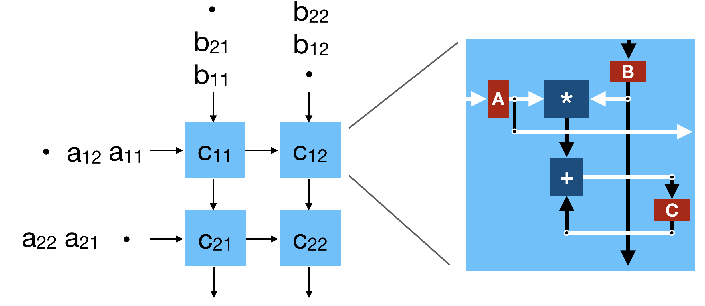

A Systolic(ish) Hardware Description Language
===============

This (as-yet-unnamed) project provides a Scala-embedded DSL which can be used to describe _systolic arrays_, a type of highly-parallel processor. The language helps users to separate the _functional correctness_ of their design from the _dataflow_ which it implements, and enables users to quickly iterate over many different dataflows to find the one which best suits their purposes.

## Introduction
With the end of Moore's Law, CPU performance is no longer increasing at the speed it once did. To run compute-intensive workloads today, computer architects are increasingly turning towards specialized hardware accelerators, especially in cases where there is massive parallelism or locality that traditional CPUs are ill-equipped to exploit. Systolic arrays are one such type of hardware accelerator; they have successfully been used to accelerate critical algorithms such as convolution<sup>[Stanford]</sup>, matrix multiplication<sup>[TPU]</sup>, sorting<sup>[SORT]</sup> and many more, both in industry and in academia.

Systolic arrays are two-dimensional arrays of small processing units (called _PEs_) carrying out the same function, which, in most cases, communicate only with the PEs directly adjacent to themselves. Thus, they help to lower communication costs, and they shine with workloads that exhibit high locality where data can be shared across many adjacent PEs within the same array.

How exactly that data flows through the array is determined by a mapping known as a _spacetime transform_, which this language helps users to explore. In the following sections, we illustrate by focusing on the example of a systolic array used to compute matrix multiplications.

## Matrix Multiplication
Matrix multiplications can be expressed with the following simple 3-level nested for loop:
```
for i ∈ [0, N1]:
    for j ∈ [0, N2]:
        C(i, j) = 0
        for k ∈ [0, N3]:
            C(i, j) += A(i, k) * B(k, j)
```
In this example, an _N1_ by _N3_ matrix _A_ is multiplied an _N3_ by _N2_ matrix _B_ to produce an _N1_ by _N2_ matrix _C_.

Matrix multiplications are an embarassingly parallelizable problem. The multiply-accumulates (MACs) in the innermost loop can be executed in parallel, and the results merged together afterwards, rather than executing them sequentially as the imperative notation used above implies.

In addition to the high-degree of parallelism, matrix multiplications exhibit high degrees of temporal and spatial locality. Every element within _A_ is re-used for _N2_ MACs, while every element of _B_ is re-used _N1_ times. Additionally, to build up a single element of _C_, _N3_ partial sums must be accumulated into a single result.

The promising potential for both parallelism and locality suggests that systolic arrays would be well suited for calculating matrix multiplications. However, the imperative notation used above obscures the parallelism and data movement patterns, which makes it difficult to map the function to a 2D systolic array. A functional notation, described below, is more appropriate.

## Functional Notation
The imperative loop written above can be re-expressed using an assignment-free, functional notation. For example, we can condense the three loop indices given above into a single _iteration vector_, (i, j, k), and use a different variable to denote each intermediate value of _C_ at each iteration:
```
// Input
c(i, j, 0) = 0

// Calculation
c(i, j, k) = c(i, j, k-1) + A(i, k) * B (k, j)

// Output
C(i, j) = c(i, j, N3)
```

This is a good start, as it expresses how _c_ values computed in different (perhaps concurrent) iterations can be merged into a final _C_ output. However, it fails to express how elements of _A_ and _B_ can also be shared and re-used. Fortunately, we can add new variables, _a_ and _b_, to do so: 
```
// Input
a(i, 0, k) = A(i, k)
b(0, j, k) = B(k, j)
c(i, j, 0) = 0

// Calculation
a(i, j, k) = a(i, j-1, k)
b(i, j, k) = b(i-1, j, k)
c(i, j, k) = c(i, j, k-1) + A(i, k) * B (k, j)

// Output
C(i, j) = c(i, j, N3)
```

And now, it becomes more apparent that _a_ travels along the _j_ index of the iteration vector, while _b_ is shared along the _i_ index.

This project allows users to describe the functionality of their systolic arrays using nearly the same syntax (but with more boilerplate):
```scala
class MatMul extends Systolic {
  // Our loop-index bounds
  val N1, N2, N3 = 1

  // The iterators that make up our iteration index, with their bounds
  val i = Iterator(0, N1)
  val j = Iterator(0, N2)
  val k = Iterator(0, N3)

  // The external inputs and outputs to our systolic array
  val A = Input(i, k)
  val B = Input(k, j)
  val C = Output(i, j)

  // The "local" variables that travel through the systolic array
  val a, b, c = Local(16) // 16 bits wide

  // Inputs
  a(i, 0, k) := A(i, k)
  b(0, j, k) := B(k, j)
  c(i, j, 0) := 0
  
  // Calculations
  a(i, j, k) := a(i, j-1, k)
  b(i, j, k) := b(i-1, j, k)
  c(i, j, k) := c(i, j, k-1) + (a(i, j-1, k) * b(i-1, j, k))

  // Outputs
  C(i, j) := c(i, j, N3)
}
```

Once our functional algorithm has been described, we need a way to map it onto a 2D systolic array. The next section explains how.

## Spacetime Transforms
Using our functional notation, we have now specified which iteration each MAC operation should occur in. We must now map these iteration vectors to _spacetime vectors_, (x, y, t), which describe the _x_ and _y_ coordinates on the 2D systolic array each MAC should occur in, as well as the time step, _t_, in which that operation should occur.


It turns out that to simplify matters, we can concentrate on only the set of linear transforms:


where _T_ is a 3 by 3 matrix.

The power of these spacetime transforms quickly becomes apparent. Simply by modifying _T_, even if the matrix multiply's functional algorithm remains completely unchanged, very different systolic arrays can be produced without sacrificing the functional correctness of our algorithm.

* Output-stationary matrix multiply:

  

  

* Weight-stationary matrix multiply:
  
  
  
  

* Hexagonal matrix multiply:

  
  
  

Although all three examples above may ultimately compute the same outputs, they do so in very different ways. Not only do they differ in size or shape, but they also differ in how partial results "flow" throughout the array. In the first example, partial sums of _C_ are fixed to specific PEs, and accumulate in place, while in the others, the partial sums travel across the array, before exiting at the edges. Based on your particular objectives or limitations, one strategy may be more attractive than another.

The language provided requires users to specify the particular spacetime transformation they wish to apply to their functional algorithm:

```scala
class MatMul extends Systolic {
  // Functional algorithm, as shown above
  // ...
  
  // Output-stationary spacetime transform
  spaceTimeTransform(Seq(
    Seq(1,0,0),
    Seq(0,1,0),
    Seq(1,1,1)))
}
```

### Constraints
As your spacetime transforms become more complex, it can become increasingly difficult to come up with new ones in an ad-hoc manner, as it becomes harder and harder to visualize how each value in your matrix is going to affect the final shape of your array. Thus, this language allows users to set high-level constraints upon the dataflow they wish to achieve. The compiler will then attempt to generate a list of spacetime transforms that meet those constraints, and which are guaranteed to result in correctly functioning hardware (although there may be other valid spacetime transforms that the compiler misses).

To set a constraint for the direction in which a variable should flow, use the `flow(v, (dx, dy))` method, which constrains a variable _v_ to travel _dx_ columns to the right, and _dy_ rows down across the 2D array every cycle. There are also some more wrapper functions provided:

```scala
fix(v)   // flow(v, (0, 0))
flowR(v) // flow(v, (0, 1))
flowD(v) // flow(v, (1, 0))
```

For example, to create an output-stationary systolic array, without manually entering the transform, we can write:

```scala
class MatMul extends Systolic {
  // Functional algorithm, as shown above
  // ...
  
  // Output-stationary spacetime transform
  fix(c)
  flowR(a)
  flowD(b)
  spaceTimeTransform()
}
```

If there are multiple transforms which meet your constraints, the compiler will require you to choose one explicitly.

## Compiler Output
After running the `spaceTimeTransform()` function, the compiler will build a mesh of PEs each implementing the function you specified, and then wire them together to match the dataflow determined by the spacetime transformation. The compiler will then generate a Verilog representation of the systolic array. It will also print out the exact input/output pattern of your systolic array, so you know at which time-steps to pass in your elements of _A_ and _B_, and when you will be able to read out _C_ (as well as the coordinates of the cells where the input/output operations take place).

The input/output pattern generated by the compiler for a 2 by 2 output-stationary systolic array is shown below:
```
Your input pattern for a is:
	At time 0, (0, 0) is input to cell (0, 0)
	At time 1, (0, 1) is input to cell (0, 0)
	At time 1, (1, 0) is input to cell (1, 0)
	At time 2, (1, 1) is input to cell (1, 0)

Your input pattern for b is:
	At time 0, (0, 0) is input to cell (0, 0)
	At time 1, (1, 0) is input to cell (0, 0)
	At time 1, (0, 1) is input to cell (0, 1)
	At time 2, (1, 1) is input to cell (0, 1)

Your output pattern for c is:
	At time 1, (0, 0) is output from cell (0, 0)
	At time 2, (0, 1) is output from cell (0, 1)
	At time 2, (1, 0) is output from cell (1, 0)
	At time 3, (1, 1) is output from cell (1, 1)
```

## Mapping Larger Matrices


## Conclusion

## Further Reading
[This chapter](http://compalg.inf.elte.hu/~tony/Informatikai-Konyvtar/03-Algorithms%20of%20Informatics%201,%202,%203/Systolic30May.pdf) from the _Algorithms of Informatics_ discusses, in a format suitable for beginners, how systolic arrays can be designed with a formal methodology.

## References

[Stanford] Yang, Xuan, et al. "DNN Dataflow Choice Is Overrated." _arXiv preprint arXiv:1809.04070_ (2018).

[TPU] Jouppi, Norman P., et al. "In-datacenter performance analysis of a tensor processing unit." _Computer Architecture (ISCA), 2017 ACM/IEEE 44th Annual International Symposium on._ IEEE, 2017.

[SORT]: Schwiegelshohn, Uwe. "A shortperiodic two-dimensional systolic sorting algorithm." _Systolic Arrays, 1988., Proceedings of the International Conference on._ IEEE, 1988.
